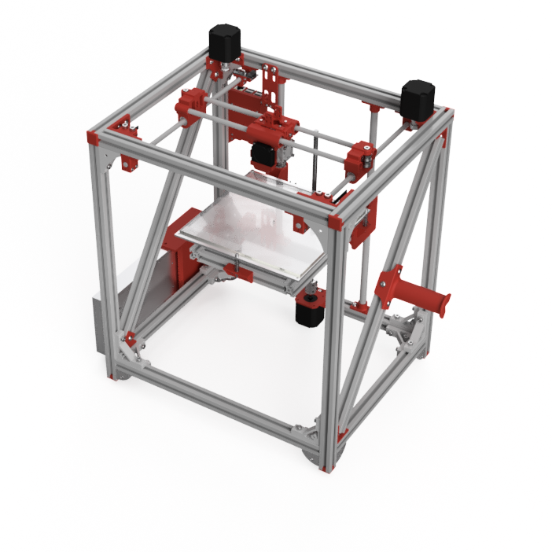

# FuseBoxSD

The FuseBoxSD 3D printer is derived from the [FB2020 Plus by AxMod3DPrint](http://github.com/AxMod3DPrint/FB2020). 

Changes from the FB2020 Plus include
* Metal brackets replace printed brackets
* The carriage and idlers have been redesigned
* The printed parts for the bed have been modified to fit the heatbed
* Many of the other printed parts have been modified for M5 screws
* The controller runs Smoothieware
* A Raspberry Pi 3 is included, for OctoPi
* A complete model is provided, in Fusion 360 and STEP formats

You will need to provide a Bowden extruder. We have been using the [Belted Extruder v4 by dintid](http://www.thingiverse.com/thing:2527297).

Copyright PopsDylan 2017.

This documentation describes Open Hardware and is licensed under the CERN OHL v. 1.2.

You may redistribute and modify this documentation under the terms of the CERN OHL v.1.2. (http://ohwr.org/cernohl). This documentation is distributed WITHOUT ANY EXPRESS OR IMPLIED WARRANTY, INCLUDING OF MERCHANTABILITY, SATISFACTORY QUALITY AND FITNESS FOR A PARTICULAR PURPOSE. Please see the CERN OHL v.1.2 for applicable conditions.

